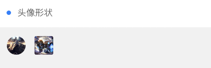
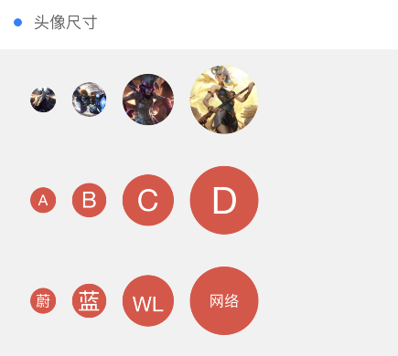
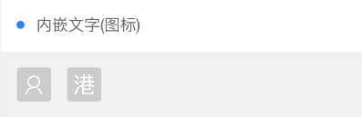
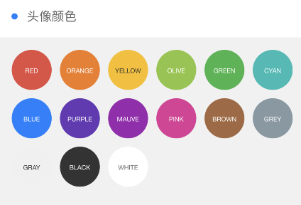
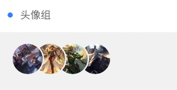
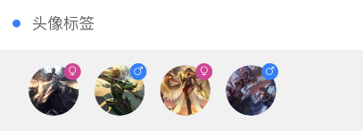

```html
<view class="cu-bar bg-white">
    <view class="action">
        <text class="cuIcon-title text-blue"></text>头像形状
    </view>
</view>
<view class="padding">
    <view class="cu-avatar round" style="background-image:url(https://ossweb-img.qq.com/images/lol/web201310/skin/big10001.jpg)"></view>
    <view class="cu-avatar radius margin-left" style="background-image:url(https://ossweb-img.qq.com/images/lol/web201310/skin/big81005.jpg);"></view>
</view>
```
---

```html
<view class="cu-bar bg-white margin-top">
    <view class="action">
        <text class="cuIcon-title text-blue"></text>头像尺寸
    </view>
</view>
<view class="padding">
    <view class="cu-avatar sm round margin-left" style="background-image:url(https://ossweb-img.qq.com/images/lol/web201310/skin/big10001.jpg)"></view>
    <view class="cu-avatar round margin-left" style="background-image:url(https://ossweb-img.qq.com/images/lol/web201310/skin/big81005.jpg);"></view>
    <view class="cu-avatar lg round margin-left" style="background-image:url(https://ossweb-img.qq.com/images/lol/web201310/skin/big25002.jpg);"></view>
    <view class="cu-avatar xl round margin-left" style="background-image:url(https://ossweb-img.qq.com/images/lol/web201310/skin/big99008.jpg);"></view>
</view>
<view class="padding">
    <view class="cu-avatar sm round margin-left bg-red"> A</view>
    <view class="cu-avatar round margin-left bg-red">B</view>
    <view class="cu-avatar lg round margin-left bg-red">C</view>
    <view class="cu-avatar xl round margin-left bg-red">D</view>
</view>
<view class="padding">
    <view class="cu-avatar sm round margin-left bg-red"> 蔚</view>
    <view class="cu-avatar round margin-left bg-red">蓝</view>
    <view class="cu-avatar lg round margin-left bg-red">
        <text>wl</text>
    </view>
    <view class="cu-avatar xl round margin-left bg-red">
        <text class="avatar-text">网络</text>
    </view>
</view>
```
---

```html
<view class="cu-bar bg-white margin-top">
    <view class="action">
        <text class="cuIcon-title text-blue"></text>内嵌文字(图标)
    </view>
</view>
<view class="padding">
    <view class="cu-avatar radius">
        <text class="cuIcon-people"></text>
    </view>
    <view class="cu-avatar radius margin-left">
        <text>港</text>
    </view>
</view>
```
---

```html
<view class="cu-bar bg-white margin-top">
    <view class="action">
        <text class="cuIcon-title text-blue"></text>头像颜色
    </view>
</view>
<view class="padding-sm">
    <view class="cu-avatar round lg margin-xs bg-red">
    	<text class="avatar-text">red</text>
    </view>
    <view class="cu-avatar round lg margin-xs bg-red">
    	<text class="avatar-text">orange</text>
    </view>
    <view class="cu-avatar round lg margin-xs bg-red">
    	<text class="avatar-text">yellow</text>
    </view>
    <view class="cu-avatar round lg margin-xs bg-red">
    	<text class="avatar-text">olive</text>
    </view>
    <view class="cu-avatar round lg margin-xs bg-red">
    	<text class="avatar-text">green</text>
    </view>
    <view class="cu-avatar round lg margin-xs bg-red">
    	<text class="avatar-text">blue</text>
    </view>
    <view class="cu-avatar round lg margin-xs bg-red">
    	<text class="avatar-text">purple</text>
    </view>
    <view class="cu-avatar round lg margin-xs bg-red">
    	<text class="avatar-text">mauve</text>
    </view>
    <view class="cu-avatar round lg margin-xs bg-red">
    	<text class="avatar-text">pink</text>
    </view>
    <view class="cu-avatar round lg margin-xs bg-red">
    	<text class="avatar-text">brown</text>
    </view>
    <view class="cu-avatar round lg margin-xs bg-red">
    	<text class="avatar-text">grey</text>
    </view>
    <view class="cu-avatar round lg margin-xs bg-red">
    	<text class="avatar-text">gray</text>
    </view>
    <view class="cu-avatar round lg margin-xs bg-red">
    	<text class="avatar-text">black</text>
    </view>
    <view class="cu-avatar round lg margin-xs bg-red">
    	<text class="avatar-text">white</text>
    </view>
</view>
```
---

```html
<view class="cu-bar bg-white margin-top">
    <view class="action">
        <text class="cuIcon-title text-blue"></text>头像组
    </view>
</view>
<view class="padding">
    <view class="cu-avatar-group">
        <view class="cu-avatar round lg" v-for="(item,index) in avatar" :key="index" :style="[{ backgroundImage:'url(' + avatar[index] + ')' }]"></view>
	</view>
</view>
```
---

```html
<view class="cu-bar bg-white margin-top">
    <view class="action">
        <text class="cuIcon-title text-blue"></text>头像标签
    </view>
</view>
<view class="padding">
    <view class="cu-avatar round lg margin-left"  v-for="(item,index) in avatar" :key="index" :style="[{ backgroundImage:'url(' + avatar[index] + ')' }]">
        <view class="cu-tag badge" :class="index%2==0?'cuIcon-female bg-pink':'cuIcon-male bg-blue'"></view>
    </view>
</view>
```
```javascript
//js代码
<script>
    export default {
		data() {
			return {
				ColorList: this.ColorList,
				avatar: [
					'https://ossweb-img.qq.com/images/lol/web201310/skin/big10001.jpg',
					'https://ossweb-img.qq.com/images/lol/web201310/skin/big81005.jpg',
					'https://ossweb-img.qq.com/images/lol/web201310/skin/big25002.jpg',
					'https://ossweb-img.qq.com/images/lol/web201310/skin/big91012.jpg'
				],

			};
		}
	}
</script>
```