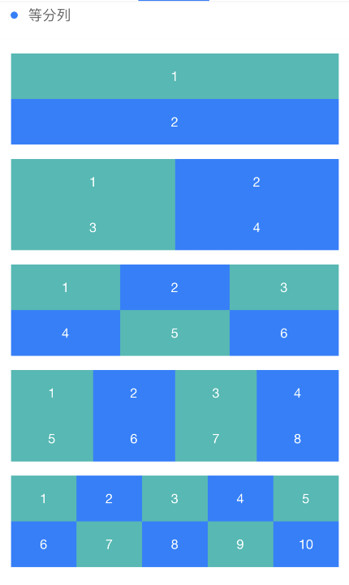
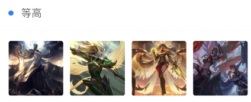

```html
<view class="cu-bar bg-white  margin-top solid-bottom">
    <view class="action">
        <text class="cuIcon-title text-blue"></text>等分列
    </view>
    <view class="action"></view>
</view>
<view class="bg-white padding">
    <view class="grid margin-bottom text-center" v-for="(item,index) in 5" :key="index" :class="'col-' + (index+1)">
        <view class="padding" :class="indexs%2==0?'bg-cyan':'bg-blue'" v-for="(item,indexs) in (index+1)*2" :key="indexs">{{indexs+1}}</view>
    </view>
</view>
<view class="cu-bar bg-white  margin-top solid-bottom">
    <view class="action">
        <text class="cuIcon-title text-blue"></text>等高
    </view>
    <view class="action"></view>
</view>
<view class="bg-white padding">
    <view class="grid col-4 grid-square">
        <view class="bg-img" v-for="(item,index) in avatar" :key="index" :style="[{ backgroundImage:'url(' + avatar[index] + ')' }]"></view>
    </view>
</view>
```