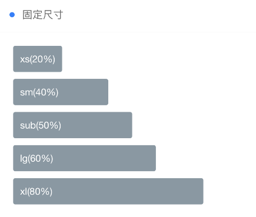
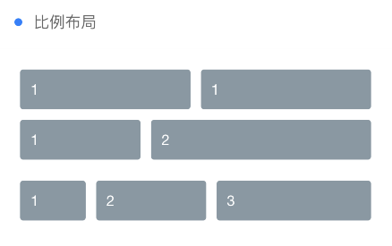
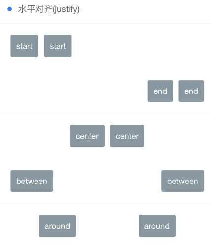
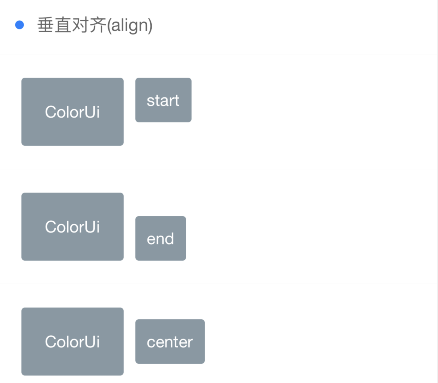

```html
<view class="cu-bar bg-white solid-bottom margin-top">
    <view class="action">
        <text class="cuIcon-title text-blue"></text>固定尺寸
    </view>
</view>

<view class="padding bg-white">
    <view class="flex flex-wrap">
        <view class="basis-xs bg-grey margin-xs padding-sm radius">xs(20%)</view>
        <view class="basis-df"></view>
        <view class="basis-sm bg-grey margin-xs padding-sm radius">sm(40%)</view>
        <view class="basis-df"></view>
        <view class="basis-df bg-grey margin-xs padding-sm radius">sub(50%)</view>
        <view class="basis-lg bg-grey margin-xs padding-sm radius">lg(60%)</view>
        <view class="basis-xl bg-grey margin-xs padding-sm radius">xl(80%)</view>
    </view>
</view>
```
---

```html
<view class="cu-bar bg-white  margin-top solid-bottom">
    <view class="action">
        <text class="cuIcon-title text-blue">比例布局</text>
    </view>
</view>
<view class="padding bg-white">
    <view class="flex">
        <view class="flex-sub bg-grey padding-sm margin-xs radius">1</view>
        <view class="flex-sub bg-grey padding-sm margin-xs radius">1</view>
    </view>
    <view class="flex  p-xs margin-bottom-sm mb-sm">
        <view class="flex-sub bg-grey padding-sm margin-xs radius">1</view>
        <view class="flex-twice bg-grey padding-sm margin-xs radius">2</view>
    </view>
    <view class="flex  p-xs margin-bottom-sm mb-sm">
        <view class="flex-sub bg-grey padding-sm margin-xs radius">1</view>
        <view class="flex-twice bg-grey padding-sm margin-xs radius">2</view>
        <view class="flex-treble bg-grey padding-sm margin-xs radius">3</view>
    </view>
</view>
```
---

```html
<view class="cu-bar bg-white  margin-top solid-bottom">
    <view class="action">
        <text class="cuIcon-title text-blue"></text>水平对齐(justify)
    </view>
</view>
<view class="bg-white">
    <view class="flex solid-bottom padding justify-start">
        <view class="bg-grey padding-sm margin-xs radius">start</view>
        <view class="bg-grey padding-sm margin-xs radius">start</view>
    </view>
    <view class="flex solid-bottom padding justify-end">
        <view class="bg-grey padding-sm margin-xs radius">end</view>
        <view class="bg-grey padding-sm margin-xs radius">end</view>
    </view>
    <view class="flex solid-bottom padding justify-center">
        <view class="bg-grey padding-sm margin-xs radius">center</view>
        <view class="bg-grey padding-sm margin-xs radius">center</view>
    </view>
    <view class="flex solid-bottom padding justify-between">
        <view class="bg-grey padding-sm margin-xs radius">between</view>
        <view class="bg-grey padding-sm margin-xs radius">between</view>
    </view>
    <view class="flex solid-bottom padding justify-around">
        <view class="bg-grey padding-sm margin-xs radius">around</view>
        <view class="bg-grey padding-sm margin-xs radius">around</view>
    </view>
</view>
```
---

```html
<view class="cu-bar bg-white  margin-top solid-bottom">
    <view class="action">
        <text class="cuIcon-title text-blue"></text>垂直对齐(align)
    </view>
</view>
<view class="bg-white">
    <view class="flex solid-bottom padding align-start">
        <view class="bg-grey padding-lg margin-xs radius">ColorUi</view>
        <view class="bg-grey padding-sm margin-xs radius">start</view>
    </view>
    <view class="flex solid-bottom padding align-end">
        <view class="bg-grey padding-lg margin-xs radius">ColorUi</view>
        <view class="bg-grey padding-sm margin-xs radius">end</view>
    </view>
    <view class="flex solid-bottom padding align-center">
        <view class="bg-grey padding-lg margin-xs radius">ColorUi</view>
        <view class="bg-grey padding-sm margin-xs radius">center</view>
    </view>
</view>
```