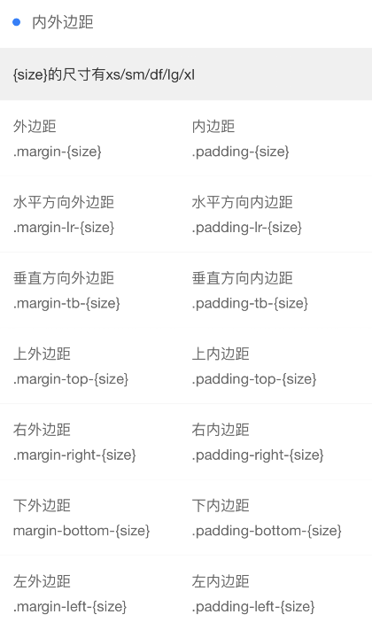

```html
<view class="cu-bar bg-white margin-top solid-bottom">
    <view class="action">
        <text class="cuIcon-title text-blue"></text>浮动
    </view>
</view>
<view class="bg-white padding">
    <view class=" cf padding-sm">
        <view class="bg-grey radius fl padding-sm">ColorUi fl</view>
        <view class="bg-grey radius fr padding-sm">ColorUi fr</view>
    </view>
</view>
```
---

```html
<view class="cu-bar bg-white  solid-bottom margin-top solid-bottom">
    <view class="action">
        <text class="cuIcon-title text-blue"></text>内外边距
    </view>
</view>
<view class="bg-white">
    <view class="padding bg-gray">{size}的尺寸有xs/sm/df/lg/xl</view>
    <view class="flex flex-wrap padding solid-top">
        <view class="basis-df padding-bottom-xs">外边距</view>
        <view class="basis-df padding-bottom-xs">内边距</view>
        <view class="basis-df">.margin-{size}</view>
        <view class="basis-df">.padding-{size}</view>
    </view>
    <view class="flex flex-wrap padding solid-top">
        <view class="basis-df padding-bottom-xs">水平方向外边距</view>
        <view class="basis-df padding-bottom-xs">水平方向内边距</view>
        <view class="basis-df">.margin-lr-{size}</view>
        <view class="basis-df">.padding-lr-{size}</view>
    </view>
    <view class="flex flex-wrap padding solid-top">
        <view class="basis-df padding-bottom-xs">垂直方向外边距</view>
        <view class="basis-df padding-bottom-xs">垂直方向内边距</view>
        <view class="basis-df">.margin-tb-{size}</view>
        <view class="basis-df">.padding-tb-{size}</view>
    </view>
    <view class="flex flex-wrap padding solid-top">
        <view class="basis-df padding-bottom-xs">上外边距</view>
        <view class="basis-df padding-bottom-xs">上内边距</view>
        <view class="basis-df">.margin-top-{size}</view>
        <view class="basis-df">.padding-top-{size}</view>
    </view>
    <view class="flex flex-wrap padding solid-top">
        <view class="basis-df padding-bottom-xs">右外边距</view>
        <view class="basis-df padding-bottom-xs">右内边距</view>
        <view class="basis-df">.margin-right-{size}</view>
        <view class="basis-df">.padding-right-{size}</view>
    </view>
    <view class="flex flex-wrap padding solid-top">
        <view class="basis-df padding-bottom-xs">下外边距</view>
        <view class="basis-df padding-bottom-xs">下内边距</view>
        <view class="basis-df">margin-bottom-{size}</view>
        <view class="basis-df">.padding-bottom-{size}</view>
    </view>
    <view class="flex flex-wrap padding solid-top">
        <view class="basis-df padding-bottom-xs">左外边距</view>
        <view class="basis-df padding-bottom-xs">左内边距</view>
        <view class="basis-df">.margin-left-{size}</view>
        <view class="basis-df">.padding-left-{size}</view>
    </view>
</view>
```