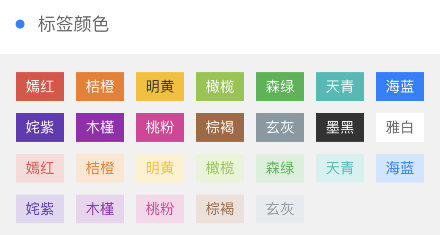
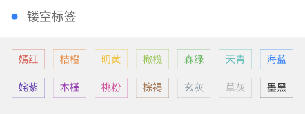
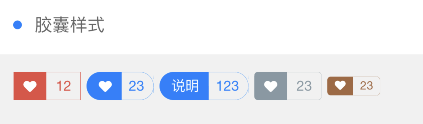
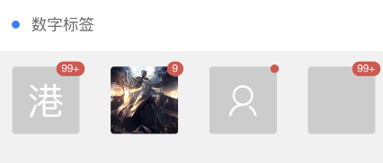

```html
<view>
    <cu-custom bgColor="bg-gradual-blue" :isBack="true">
        <block slot="backText">返回</block>
        <block slot="content">标签</block>
    </cu-custom>
    <view class="cu-bar bg-white solid-bottom">
        <view class='action'>
            <text class='cuIcon-title text-blue'></text>标签形状
        </view>
	</view>
	<view class="padding bg-white solid-bottom">
        <view class='cu-tag'>默认</view>
        <view class='cu-tag round'>椭圆</view>
        <view class='cu-tag radius'>圆角</view>
	</view>
</view>
```
---

```html
<view class="cu-bar bg-white margin-top">
    <view class='action'>
        <text class='cuIcon-title text-blue'></text>标签尺寸
    </view>
</view>
<view class="padding bg-white">
    <view class='cu-tag radius sm'>小尺寸</view>
    <view class='cu-tag radius'>普通尺寸</view>
</view>
```
---

```html
<view class="cu-bar bg-white margin-top">
    <view class='action'>
        <text class='cuIcon-title text-blue'></text>标签颜色
    </view>
</view>
<view class='padding-sm flex flex-wrap'>
    <view class="padding-xs" >
        <view class='cu-tag bg-red'>嫣红</view>
		<view class='cu-tag bg-orange'>桔橙</view>
		<view class='cu-tag bg-yellow'>明黄</view>
		<view class='cu-tag bg-olive'>橄榄</view>
		<view class='cu-tag bg-green'>森绿</view>
		<view class='cu-tag bg-cyan'>天青</view>
		<view class='cu-tag bg-blue'>海蓝</view>
		<view class='cu-tag bg-purple'>姹紫</view>
		<view class='cu-tag bg-mauve'>木槿</view>
		<view class='cu-tag bg-pink'>桃粉</view>
		<view class='cu-tag bg-brown'>棕褐</view>
		<view class='cu-tag bg-grey'>玄灰</view>
		<view class='cu-tag bg-gray'>草灰</view>
		<view class='cu-tag bg-black'>墨黑</view>
		<view class='cu-tag bg-white'>雅白</view>
    </view>
    
    <view class="padding-xs">
        <view class='cu-tag light bg-red'>嫣红</view>
        <view class='cu-tag light bg-orange'>桔橙</view>
        <view class='cu-tag light bg-yellow'>明黄</view>
        <view class='cu-tag light bg-olive'>橄榄</view>
        <view class='cu-tag light bg-green'>森绿</view>
        <view class='cu-tag light bg-cyan'>天青</view>
        <view class='cu-tag light bg-blue'>海蓝</view>
        <view class='cu-tag light bg-purple'>姹紫</view>
        <view class='cu-tag light bg-mauve'>木槿</view>
        <view class='cu-tag light bg-pink'>桃粉</view>
        <view class='cu-tag light bg-brown'>棕褐</view>
        <view class='cu-tag light bg-grey'>玄灰</view>
    </view>
</view>
```
---

```html
<view class="cu-bar bg-white margin-top">
    <view class='action'>
        <text class='cuIcon-title text-blue'></text>镂空标签
    </view>
</view>
<view class='padding-sm flex flex-wrap'>
    <view class="padding-xs" >
        <view class='cu-tag line-red'>嫣红</view>
        <view class='cu-tag line-orange'>桔橙</view>
        <view class='cu-tag line-yellow'>明黄</view>
        <view class='cu-tag line-olive'>橄榄</view>
        <view class='cu-tag line-green'>森绿</view>
        <view class='cu-tag line-cyan'>天青</view>
        <view class='cu-tag line-blue'>海蓝</view>
        <view class='cu-tag line-purple'>姹紫</view>
        <view class='cu-tag line-mauve'>木槿</view>
        <view class='cu-tag line-pink'>桃粉</view>
        <view class='cu-tag line-brown'>棕褐</view>
        <view class='cu-tag line-grey'>玄灰</view>
        <view class='cu-tag line-gray'>草灰</view>
        <view class='cu-tag line-black'>墨黑</view>
        <view class='cu-tag line-white'>雅白</view>
    </view>
</view>
```
---

```html
<view class="cu-bar bg-white margin-top">
    <view class='action'>
        <text class='cuIcon-title text-blue'></text>胶囊样式
    </view>
</view>
<view class="padding">
    <view class="cu-capsule">
        <view class='cu-tag bg-red'>
            <text class='cuIcon-likefill'></text>
        </view>
        <view class="cu-tag line-red">12</view>
    </view>
    <view class="cu-capsule round">
        <view class='cu-tag bg-blue '>
            <text class='cuIcon-likefill'></text>
        </view>
        <view class="cu-tag line-blue">23</view>
    </view>
    <view class="cu-capsule round">
        <view class='cu-tag bg-blue'>说明</view>
        <view class="cu-tag line-blue">123</view>
    </view>
    <view class="cu-capsule radius">
        <view class='cu-tag bg-grey '>
            <text class='cuIcon-likefill'></text>
        </view>
        <view class="cu-tag line-grey">23</view>
    </view>
    <view class="cu-capsule radius">
        <view class='cu-tag bg-brown sm'>
            <text class='cuIcon-likefill'></text>
        </view>
        <view class="cu-tag line-brown sm">23</view>
    </view>
</view>
```
---

```html
<view class="cu-bar bg-white margin-top">
    <view class='action'>
        <text class='cuIcon-title text-blue'></text>数字标签
    </view>
</view>
<view class="padding flex justify-between align-center">
    <view class='cu-avatar xl radius'>港
    <view class="cu-tag badge">99+</view>
</view>
<view class='cu-avatar xl radius' style="background-image:url(https://ossweb-img.qq.com/images/lol/web201310/skin/big10001.jpg)">
    <view class='cu-tag badge'>9</view>
</view>
<view class='cu-avatar xl radius'>
    <view class='cu-tag badge'>99</view>
    <text class='cuIcon-people'></text>
</view>
<view class='cu-avatar xl radius'>
    <view class='cu-tag badge'>99+</view>
</view>
```