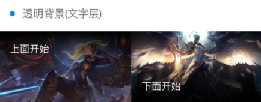

```javascript
<template>
    <view>
        <view class="cu-bar bg-white solid-bottom">
            <view class="action">
                <text class='cuIcon-title text-blue'></text>深色背景
			</view>
		</view>
		<view class="grid col-3 padding-sm">
			<view class="padding-sm">
				<view class="padding radius text-center shadow-blur bg-red" >
                    <view class="text-lg">嫣红</view>
                    <view class="margin-top-sm text-Abc">red</view>
				</view>
			</view>
			<view class="padding-sm">
				<view class="padding radius text-center shadow-blur bg-orange" >
					<view class="text-lg">桔橙</view>
					<view class="margin-top-sm text-Abc">orange</view>
				</view>
			</view>
			<view class="padding-sm">
				<view class="padding radius text-center shadow-blur bg-yellow" >
					<view class="text-lg">明黄</view>
					<view class="margin-top-sm text-Abc">yellow</view>
				</view>
			</view>
			<view class="padding-sm">
				<view class="padding radius text-center shadow-blur bg-olive" >
					<view class="text-lg">橄榄</view>
					<view class="margin-top-sm text-Abc">olive</view>
				</view>
			</view>
			<view class="padding-sm">
				<view class="padding radius text-center shadow-blur bg-green" >
					<view class="text-lg">森绿</view>
					<view class="margin-top-sm text-Abc">green</view>
				</view>
			</view>
			<view class="padding-sm">
				<view class="padding radius text-center shadow-blur bg-cyan" >
					<view class="text-lg">天青</view>
					<view class="margin-top-sm text-Abc">cyan</view>
				</view>
			</view>
			
			<view class="padding-sm">
				<view class="padding radius text-center shadow-blur bg-blue" >
					<view class="text-lg">海蓝</view>
					<view class="margin-top-sm text-Abc">blue</view>
				</view>
			</view>
			<view class="padding-sm">
				<view class="padding radius text-center shadow-blur bg-purple" >
					<view class="text-lg">姹紫</view>
					<view class="margin-top-sm text-Abc">purple</view>
				</view>
			</view>
			<view class="padding-sm">
				<view class="padding radius text-center shadow-blur bg-mauve" >
					<view class="text-lg">木槿</view>
					<view class="margin-top-sm text-Abc">mauve</view>
				</view>
			</view>
			<view class="padding-sm">
				<view class="padding radius text-center shadow-blur bg-pink" >
					<view class="text-lg">桃粉</view>
					<view class="margin-top-sm text-Abc">pink</view>
				</view>
			</view>
			<view class="padding-sm">
				<view class="padding radius text-center shadow-blur bg-brown" >
					<view class="text-lg">棕褐</view>
					<view class="margin-top-sm text-Abc">brown</view>
				</view>
			</view>
			<view class="padding-sm">
				<view class="padding radius text-center shadow-blur bg-grey" >
					<view class="text-lg">玄灰</view>
					<view class="margin-top-sm text-Abc">grey</view>
				</view>
			</view>
			<view class="padding-sm">
				<view class="padding radius text-center shadow-blur bg-gray" >
					<view class="text-lg">草灰</view>
					<view class="margin-top-sm text-Abc">gray</view>
				</view>
			</view>
			<view class="padding-sm">
				<view class="padding radius text-center shadow-blur bg-black" >
					<view class="text-lg">墨黑</view>
					<view class="margin-top-sm text-Abc">black</view>
				</view>
			</view>
			<view class="padding-sm">
				<view class="padding radius text-center shadow-blur bg-white" >
					<view class="text-lg">雅白</view>
					<view class="margin-top-sm text-Abc">white</view>
				</view>
			</view>
        </view>
    </view>
</template>
```
---

```javascript
<template>
    <view class="cu-bar bg-white solid-bottom">
        <view class="action">
			<text class="cuIcon-title text-blue"></text>淡色背景
		</view>
    </view>
    <view class="grid col-3 bg-white padding-sm">
        <view class="padding-sm" >
			<view class="padding radius text-center light bg-red" >
				<view class="text-lg">嫣红</view>
				<view class="margin-top-sm text-Abc">red</view>
			</view>
        </view>
		<view class="padding-sm">
			<view class="padding radius text-center light bg-orange" >
				<view class="text-lg">桔橙</view>
				<view class="margin-top-sm text-Abc">orange</view>
			</view>
		</view>
		<view class="padding-sm">
			<view class="padding radius text-center light bg-yellow" >
				<view class="text-lg">明黄</view>
				<view class="margin-top-sm text-Abc">yellow</view>
			</view>
		</view>
		<view class="padding-sm">
			<view class="padding radius text-center light bg-olive" >
				<view class="text-lg">橄榄</view>
				<view class="margin-top-sm text-Abc">olive</view>
			</view>
		</view>
		<view class="padding-sm">
			<view class="padding radius text-center light bg-green" >
				<view class="text-lg">森绿</view>
				<view class="margin-top-sm text-Abc">green</view>
			</view>
		</view>
		<view class="padding-sm">
			<view class="padding radius text-center light bg-cyan" >
				<view class="text-lg">天青</view>
				<view class="margin-top-sm text-Abc">cyan</view>
			</view>
		</view>
		
		<view class="padding-sm">
			<view class="padding radius text-center light bg-blue" >
				<view class="text-lg">海蓝</view>
				<view class="margin-top-sm text-Abc">blue</view>
			</view>
		</view>
		<view class="padding-sm">
			<view class="padding radius text-center light bg-purple" >
				<view class="text-lg">姹紫</view>
				<view class="margin-top-sm text-Abc">purple</view>
			</view>
		</view>
		<view class="padding-sm">
			<view class="padding radius text-center light bg-mauve" >
				<view class="text-lg">木槿</view>
				<view class="margin-top-sm text-Abc">mauve</view>
			</view>
		</view>
		<view class="padding-sm">
			<view class="padding radius text-center light bg-pink" >
				<view class="text-lg">桃粉</view>
				<view class="margin-top-sm text-Abc">pink</view>
			</view>
		</view>
		<view class="padding-sm">
			<view class="padding radius text-center light bg-brown" >
				<view class="text-lg">棕褐</view>
				<view class="margin-top-sm text-Abc">brown</view>
			</view>
		</view>
		<view class="padding-sm">
			<view class="padding radius text-center light bg-grey" >
				<view class="text-lg">玄灰</view>
				<view class="margin-top-sm text-Abc">grey</view>
			</view>
		</view>
	</view>
</template>
```
---

```javascript
<template>
    <view class="cu-bar bg-white solid-bottom margin-top">
        <view class="action">
            <text class="cuIcon-title text-blue"></text>渐变背景
		</view>
    </view>
    <view class="grid col-2 padding-sm">
        <view class="padding-sm">
            <view class="bg-gradual-red padding radius text-center shadow-blur">
                <view class="text-lg">魅红</view>
                <view class="margin-top-sm text-Abc">#f43f3b - #ec008c</view>
			</view>
		</view>
		<view class="padding-sm">
			<view class="bg-gradual-orange padding radius text-center shadow-blur">
				<view class="text-lg">鎏金</view>
				<view class="margin-top-sm text-Abc">#ff9700 - #ed1c24</view>
			</view>
		</view>
		<view class="padding-sm">
			<view class="bg-gradual-green padding radius text-center shadow-blur">
				<view class="text-lg">翠柳</view>
				<view class="margin-top-sm text-Abc">#39b54a - #8dc63f</view>
			</view>
		</view>
		<view class="padding-sm">
			<view class="bg-gradual-blue padding radius text-center shadow-blur">
				<view class="text-lg">靛青</view>
				<view class="margin-top-sm text-Abc">#0081ff - #1cbbb4</view>
			</view>
		</view>
		<view class="padding-sm">
			<view class="bg-gradual-purple padding radius text-center shadow-blur">
				<view class="text-lg">惑紫</view>
				<view class="margin-top-sm text-Abc">#9000ff - #5e00ff</view>
			</view>
		</view>
		<view class="padding-sm">
			<view class="bg-gradual-pink padding radius text-center shadow-blur">
				<view class="text-lg">霞彩</view>
				<view class="margin-top-sm text-Abc">#ec008c - #6739b6</view>
			</view>
		</view>
	</view>
</template>
```
---

```javascript
<template>
    <view class="cu-bar bg-white margin-top">
        <view class="action">
            <text class="cuIcon-title text-blue"></text>图片背景
        </view>
    </view>
    <view class="bg-img bg-mask flex align-center" style="background-image: url('https://ossweb-img.qq.com/images/lol/web201310/skin/big10006.jpg');height: 414upx;">
        <view class="padding-xl text-white">
            <view class="padding-xs text-xxl text-bold">钢铁之翼</view>
            <view class="padding-xs text-lg">Only the guilty need fear me.</view>
		</view>
	</view>
</template>
```
---

```javascript
<template>
    <view class="cu-bar bg-white margin-top">
        <view class="action">
            <text class="cuIcon-title text-blue"></text>透明背景(文字层)
        </view>
    </view>
    <view class="grid col-2">
        <view class="bg-img padding-bottom-xl" style="background-image: url('https://ossweb-img.qq.com/images/lol/web201310/skin/big10007.jpg');height: 207upx;">
            <view class="bg-shadeTop padding padding-bottom-xl">上面开始</view>
        </view>
        <view class="bg-img padding-top-xl flex align-end" style="background-image: url('https://ossweb-img.qq.com/images/lol/web201310/skin/big10001.jpg');height: 207upx;">
            <view class="bg-shadeBottom padding padding-top-xl flex-sub">下面开始</view>
        </view>
    </view>
</template>
```