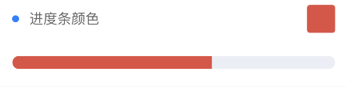

```html
<view class="cu-bar bg-white solid-bottom">
    <view class="action">
        <text class="cuIcon-title text-blue"></text>进度条形状
    </view>
</view>
<view class="padding bg-white">
    <view class="cu-progress">
        <view class="bg-red" :style="[{ width:loading?'61.8%':''}]">61.8%</view>
    </view>
    <view class="cu-progress radius margin-top">
        <view class="bg-red" :style="[{ width:loading?'61.8%':''}]">61.8%</view>
    </view>
    <view class="cu-progress round margin-top">
        <view class="bg-red" :style="[{ width:loading?'61.8%':''}]">61.8%</view>
    </view>
</view>
<view class="cu-bar bg-white solid-bottom margin-top">
    <view class="action">
        <text class="cuIcon-title text-blue"></text>进度条尺寸
    </view>
</view>
<view class="padding bg-white">
    <view class="cu-progress round">
        <view class="bg-red" :style="[{ width:loading?'61.8%':''}]"></view>
    </view>
    <view class="cu-progress round margin-top sm">
        <view class="bg-red" :style="[{ width:loading?'61.8%':''}]"></view>
    </view>
    <view class="cu-progress round margin-top xs">
        <view class="bg-red" :style="[{ width:loading?'61.8%':''}]"></view>
    </view>
</view>
```
```javascript
//js代码
<script>
	export default {
		data() {
			return {
				loading: false,
			};
		},
		onLoad: function() {
			let that = this;
			setTimeout(function() {
				that.loading = true
			}, 500)
		},
	}
</script>
```
---

```html
<view class="cu-bar bg-white solid-bottom margin-top" @tap="showModal" data-target="ColorModal">
    <view class="action">
        <text class="cuIcon-title text-blue"></text>进度条颜色
    </view>
    <view class="action">
        <view class="padding solid radius shadow-blur" :class="'bg-' + color"></view>
    </view>
</view>
<view class="padding" :class="color=='white'?'bg-grey':'bg-white'">
    <view class="cu-progress round">
        <view :class="'bg-' + color" :style="[{ width:loading?'61.8%':''}]"></view>
    </view>
</view>
<view class="cu-modal" :class="modalName=='ColorModal'?'show':''">
    <view class="cu-dialog">
        <view class="cu-bar justify-end solid-bottom">
            <view class="content">选择颜色</view>
            <view class="action" @tap="hideModal">
                <text class="cuIcon-close text-red"></text>
            </view>
        </view>
        <view class="grid col-5 padding">
            <view class="padding-xs" v-for="(item,index) in ColorList" :key="index" @tap="SetColor" :data-color="item.name" v-if="item.name!='gray' && item.name!='white'">
                <view class="padding-tb radius" :class="'bg-' + item.name"> {{item.title}} </view>
            </view>
        </view>
    </view>
</view>
```
```javascript
//js代码
<script>
	export default {
		data() {
			return {
				ColorList : [{
						title: '嫣红',
						name: 'red',
						color: '#e54d42'
					},
					{
						title: '桔橙',
						name: 'orange',
						color: '#f37b1d'
					},
					{
						title: '明黄',
						name: 'yellow',
						color: '#fbbd08'
					},
					{
						title: '橄榄',
						name: 'olive',
						color: '#8dc63f'
					},
					{
						title: '森绿',
						name: 'green',
						color: '#39b54a'
					},
					{
						title: '天青',
						name: 'cyan',
						color: '#1cbbb4'
					},
					{
						title: '海蓝',
						name: 'blue',
						color: '#0081ff'
					},
					{
						title: '姹紫',
						name: 'purple',
						color: '#6739b6'
					},
					{
						title: '木槿',
						name: 'mauve',
						color: '#9c26b0'
					},
					{
						title: '桃粉',
						name: 'pink',
						color: '#e03997'
					},
					{
						title: '棕褐',
						name: 'brown',
						color: '#a5673f'
					},
					{
						title: '玄灰',
						name: 'grey',
						color: '#8799a3'
					},
					{
						title: '草灰',
						name: 'gray',
						color: '#aaaaaa'
					},
					{
						title: '墨黑',
						name: 'black',
						color: '#333333'
					},
					{
						title: '雅白',
						name: 'white',
						color: '#ffffff'
					},
				],
				color: 'red',
				loading: false,
				modalName: '',
			}
		},
		onLoad: function() {
			let that = this;
			setTimeout(function() {
				that.loading = true
			}, 500)
		},
		methods: {
			showModal(e) {
				this.modalName = e.currentTarget.dataset.target
			},
				hideModal(e) {
				this.modalName = null
			},
			SetColor(e) {
				this.color = e.currentTarget.dataset.color;
				this.modalName = null
			},
		}
	}
</script>
```
---


```html
<view class="cu-bar bg-white solid-bottom margin-top">
    <view class="action">
        <text class="cuIcon-title text-blue"></text>进度条条纹
    </view>
    <switch class="margin-right-sm" :class="active?'checked':''" @change="SetActive"></switch>
</view>
<view class="padding bg-white">
    <view class="cu-progress round sm striped" :class="active?'active':''">
        <view class="bg-green" :style="[{ width:loading?'60%':''}]"></view>
    </view>
    <view class="cu-progress round sm margin-top-sm striped" :class="active?'active':''">
        <view class="bg-black" :style="[{ width:loading?'40%':''}]"></view>
    </view>
</view>
<view class="cu-bar bg-white solid-bottom margin-top">
    <view class="action">
    	<text class="cuIcon-title text-blue"></text>进度条比例
    </view>
</view>
<view class="padding bg-white">
	<view class="cu-progress radius striped active">
		<view class="bg-red" :style="[{ width:loading?'30%':''}]">30%</view>
		<view class="bg-olive" :style="[{ width:loading?'45%':''}]">45%</view>
		<view class="bg-cyan" :style="[{ width:loading?'25%':''}]">25%</view>
	</view>
</view>
<view class="cu-bar bg-white solid-bottom margin-top">
	<view class="action">
		<text class="cuIcon-title text-blue"></text>进度条布局
	</view>
</view>
<view class="padding bg-white ">
	<view class="flex">
		<view class="cu-progress round">
			<view class="bg-green" :style="[{ width:loading?'100%':''}]"></view>
		</view>
		<text class="cuIcon-roundcheckfill text-green margin-left-sm"></text>
	</view>
	<view class="flex margin-top">
		<view class="cu-progress round">
			<view class="bg-green" :style="[{ width:loading?'80%':''}]"></view>
		</view>
		<text class="margin-left">80%</text>
	</view>
</view>
```
```javascript
//js代码
<script>
	export default {
		data() {
			return {
				loading: false,
				active: false
			};
		},
		onLoad: function() {
			let that = this;
			setTimeout(function() {
				that.loading = true
			}, 500)
		},
		methods: {
			SetActive(e) {
				this.active = e.detail.value
			},
		}
	}
</script>
```