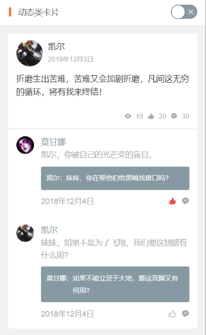
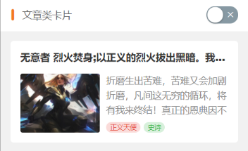

noborder用来控制有没有边框线，一列有几行由col-n 来控制
```html
<view class="cu-list grid col-4" >
  <view class="cu-item" v-for="(item,index) in 4" :key="index" >
    <view class="cuIcon-cardboardfill text-red">
      <view class="cu-tag badge" >
        <block>99</block>
      </view>
    </view>
    <text>vr</text>
  </view>
</view>
<view class="cu-list grid col-4 no-border" >
  <view class="cu-item" v-for="(item,index) in 4" :key="index" >
    <view class="cuIcon-cardboardfill text-red">
      <view class="cu-tag">
      </view>
    </view>
    <text>vr</text>
  </view>
</view>
```
---

```html
<view class="cu-bar bg-white solid-bottom margin-top">
	<view class="action">
		<text class="cuIcon-title text-orange"></text> 菜单列表
	</view>
</view>
<view class="cu-list menu sm-border card-menu margin-top" >
	<view class="cu-item arrow" >
		<view class="content">
			<text class="cuIcon-circlefill text-grey"></text>
			<text class="text-grey">图标 + 标题</text>
		</view>
	</view>
	<view class="cu-item arrow" >
		<view class="content">
			<image src="../../../images/tabbar/wo.png" class="png" mode="aspectFit"></image>
			<text class="text-grey">图片 + 标题</text>
		</view>
	</view>
	<view class="cu-item arrow" >
		<button class="cu-btn content" open-type="contact">
			<text class="cuIcon-btn text-olive"></text>
			<text class="text-grey">Open-type 按钮</text>
		</button>
	</view>
	<view class="cu-item arrow" >
		<navigator class="content" hover-class="none" url="../list/list" open-type="redirect">
			<text class="cuIcon-discoverfill text-orange"></text>
			<text class="text-grey">Navigator 跳转</text>
		</navigator>
	</view>
	<view class="cu-item arrow" >
		<view class="content">
			<text class="cuIcon-emojiflashfill text-pink"></text>
			<text class="text-grey">头像组</text>
		</view>
		<view class="action">
			<view class="cu-avatar-group">
				<view class="cu-avatar round sm" style="background-image:url(https://ossweb-img.qq.com/images/lol/web201310/skin/big10001.jpg);"></view>
				<view class="cu-avatar round sm" style="background-image:url(https://ossweb-img.qq.com/images/lol/web201310/skin/big81005.jpg);"></view>
				<view class="cu-avatar round sm" style="background-image:url(https://ossweb-img.qq.com/images/lol/web201310/skin/big25002.jpg);"></view>
				<view class="cu-avatar round sm" style="background-image:url(https://ossweb-img.qq.com/images/lol/web201310/skin/big91012.jpg);"></view>
			</view>
			<text class="text-grey text-sm">4 人</text>
		</view>
	</view>
	<view class="cu-item arrow">
		<view class="content">
			<text class="cuIcon-btn text-green"></text>
			<text class="text-grey">按钮</text>
		</view>
		<view class="action">
			<button class="cu-btn round bg-green shadow">
				<text class="cuIcon-upload"></text> 上传</button>
		</view>
	</view>
	<view class="cu-item arrow" >
		<view class="content">
			<text class="cuIcon-tagfill text-red  margin-right-xs"></text>
			<text class="text-grey">标签</text>
		</view>
		<view class="action">
			<view class="cu-tag round bg-orange light">音乐</view>
			<view class="cu-tag round bg-olive light">电影</view>
			<view class="cu-tag round bg-blue light">旅行</view>
		</view>
	</view>
	<view class="cu-item arrow">
		<view class="content">
			<text class="cuIcon-warn text-green"></text>
			<text class="text-grey">文本</text>
		</view>
		<view class="action">
			<text class="text-grey text-sm">小目标还没有实现！</text>
		</view>
	</view>
	<view class="cu-item">
		<view class="content padding-tb-sm">
			<view>
				<text class="cuIcon-clothesfill text-blue margin-right-xs"></text> 多行Item</view>
			<view class="text-gray text-sm">
				<text class="cuIcon-infofill margin-right-xs"></text> 小目标还没有实现！</view>
		</view>
		<view class="action">
			<switch class="switch-sex checked skin"></switch>
		</view>
	</view>
</view>
```
---


由card-menu 来控制是否是卡片形式。

由 sm-border来控制边框是否撑满屏幕，没有边框外边距。
```html
<view class="cu-bar bg-white solid-bottom margin-top">
	<view class="action">
		<text class="cuIcon-title text-orange"></text> 菜单列表
	</view>
</view>
<view class="cu-list menu sm-border  margin-top" >
	<view class="cu-item arrow" >
		<view class="content">
			<text class="cuIcon-circlefill text-grey"></text>
			<text class="text-grey">图标 + 标题</text>
		</view>
	</view>
	<view class="cu-item arrow" >
		<view class="content">
			<image src="../../../images/tabbar/wo.png" class="png" mode="aspectFit"></image>
			<text class="text-grey">图片 + 标题</text>
		</view>
	</view>
	<view class="cu-item arrow" >
		<button class="cu-btn content" open-type="contact">
			<text class="cuIcon-btn text-olive"></text>
			<text class="text-grey">Open-type 按钮</text>
		</button>
	</view>
	<view class="cu-item arrow" >
		<navigator class="content" hover-class="none" url="../list/list" open-type="redirect">
			<text class="cuIcon-discoverfill text-orange"></text>
			<text class="text-grey">Navigator 跳转</text>
		</navigator>
	</view>
	<view class="cu-item arrow" >
		<view class="content">
			<text class="cuIcon-emojiflashfill text-pink"></text>
			<text class="text-grey">头像组</text>
		</view>
		<view class="action">
			<view class="cu-avatar-group">
				<view class="cu-avatar round sm" style="background-image:url(https://ossweb-img.qq.com/images/lol/web201310/skin/big10001.jpg);"></view>
				<view class="cu-avatar round sm" style="background-image:url(https://ossweb-img.qq.com/images/lol/web201310/skin/big81005.jpg);"></view>
				<view class="cu-avatar round sm" style="background-image:url(https://ossweb-img.qq.com/images/lol/web201310/skin/big25002.jpg);"></view>
				<view class="cu-avatar round sm" style="background-image:url(https://ossweb-img.qq.com/images/lol/web201310/skin/big91012.jpg);"></view>
			</view>
			<text class="text-grey text-sm">4 人</text>
		</view>
	</view>
	<view class="cu-item arrow">
		<view class="content">
			<text class="cuIcon-btn text-green"></text>
			<text class="text-grey">按钮</text>
		</view>
		<view class="action">
			<button class="cu-btn round bg-green shadow">
				<text class="cuIcon-upload"></text> 上传</button>
		</view>
	</view>
	<view class="cu-item arrow" >
		<view class="content">
			<text class="cuIcon-tagfill text-red  margin-right-xs"></text>
			<text class="text-grey">标签</text>
		</view>
		<view class="action">
			<view class="cu-tag round bg-orange light">音乐</view>
			<view class="cu-tag round bg-olive light">电影</view>
			<view class="cu-tag round bg-blue light">旅行</view>
		</view>
	</view>
	<view class="cu-item arrow">
		<view class="content">
			<text class="cuIcon-warn text-green"></text>
			<text class="text-grey">文本</text>
		</view>
		<view class="action">
			<text class="text-grey text-sm">小目标还没有实现！</text>
		</view>
	</view>
	<view class="cu-item">
		<view class="content padding-tb-sm">
			<view>
				<text class="cuIcon-clothesfill text-blue margin-right-xs"></text> 多行Item</view>
			<view class="text-gray text-sm">
				<text class="cuIcon-infofill margin-right-xs"></text> 小目标还没有实现！</view>
		</view>
		<view class="action">
			<switch class="switch-sex checked skin"></switch>
		</view>
	</view>
</view>
```
---

```html
<view class="cu-bar bg-white solid-bottom margin-top">
	<view class="action">
		<text class="cuIcon-title text-orange "></text> 消息列表
	</view>
</view>
<view class="cu-list menu-avatar">
	<view class="cu-item">
		<view class="cu-avatar round lg" style="background-image:url(https://ossweb-img.qq.com/images/lol/web201310/skin/big10001.jpg);"></view>
		<view class="content">
			<view class="text-grey">凯尔</view>
			<view class="text-gray text-sm flex">
				<view class="text-cut">
					<text class="cuIcon-infofill text-red  margin-right-xs"></text>
					我已天理为凭，踏入这片荒芜，不再受凡人的枷锁遏制。我已天理为凭，踏入这片荒芜，不再受凡人的枷锁遏制。
				</view> </view>
		</view>
		<view class="action">
			<view class="text-grey text-xs">22:20</view>
			<view class="cu-tag round bg-grey sm">5</view>
		</view>
	</view>
	<view class="cu-item">
		<view class="cu-avatar round lg" style="background-image:url(https://ossweb-img.qq.com/images/lol/img/champion/Taric.png);">
			<view class="cu-tag badge">99+</view>
		</view>
		<view class="content">
			<view class="text-grey">
				<view class="text-cut">瓦洛兰之盾-塔里克</view>
				<view class="cu-tag round bg-orange sm">战士</view>
			</view>
			<view class="text-gray text-sm flex">
				<view class="text-cut">
					塔里克是保护者星灵，用超乎寻常的力量守护着符文之地的生命、仁爱以及万物之美。塔里克由于渎职而被放逐，离开了祖国德玛西亚，前去攀登巨神峰寻找救赎，但他找到的却是来自星界的更高层的召唤。现在的塔里克与古代巨神族的神力相融合，以瓦洛兰之盾的身份，永不疲倦地警惕着阴险狡诈的虚空腐化之力。
				</view>
			</view>
		</view>
		<view class="action">
			<view class="text-grey text-xs">22:20</view>
			<view class="cuIcon-notice_forbid_fill text-gray"></view>
		</view>
	</view>
	<view class="cu-item ">
		<view class="cu-avatar radius lg" style="background-image:url(https://ossweb-img.qq.com/images/lol/img/champion/Morgana.png);"></view>
		<view class="content">
			<view class="text-pink"><view class="text-cut">莫甘娜</view></view>
			<view class="text-gray text-sm flex"> <view class="text-cut">凯尔，你被自己的光芒变的盲目！</view></view>
		</view>
		<view class="action">
			<view class="text-grey text-xs">22:20</view>
			<view class="cu-tag round bg-red sm">5</view>
		</view>
	</view>
	<view class="cu-item grayscale">
		<view class="cu-avatar radius lg" style="background-image:url(https://ossweb-img.qq.com/images/lol/web201310/skin/big81007.jpg);"></view>
		<view class="content">
			<view><view class="text-cut">伊泽瑞尔</view>
				<view class="cu-tag round bg-orange sm">断开连接...</view>
			</view>
			<view class="text-gray text-sm flex"> <view class="text-cut"> 等我回来一个打十个</view></view>
		</view>
		<view class="action">
			<view class="text-grey text-xs">22:20</view>
			<view class="cu-tag round bg-red sm">5</view>
		</view>
	</view>
	<view class="cu-item cur">
		<view class="cu-avatar radius lg" style="background-image:url(https://ossweb-img.qq.com/images/lol/web201310/skin/big81020.jpg);">
			<view class="cu-tag badge"></view>
		</view>
		<view class="content">
			<view>
				<view class="text-cut">瓦罗兰大陆-睡衣守护者-新手保护营</view>
				<view class="cu-tag round bg-orange sm">6人</view>
			</view>
			<view class="text-gray text-sm flex">
				<view class="text-cut"> 伊泽瑞尔：<text class="cuIcon-locationfill text-orange margin-right-xs"></text> 传送中...</view></view>
		</view>
		<view class="action">
			<view class="text-grey text-xs">22:20</view>
			<view class="cuIcon-notice_forbid_fill text-gray"></view>
		</view>
	</view>
</view>
```
---



```html
<view>
	<view class="cu-bar bg-white solid-bottom">
		<view class="action">
			<text class="cuIcon-titles text-orange"></text> 案例类卡片
		</view>
		<view class="action">
			<switch :class="isCard?'checked':''" :checked="isCard?true:false" change="IsCard"></switch>
		</view>
	</view>
	<view class="cu-card case" :class="isCard?'no-card':''">
		<view class="cu-item shadow">
			<view class="image">
				<image src="https://ossweb-img.qq.com/images/lol/web201310/skin/big10006.jpg"
				 mode="widthFix"></image>
				<view class="cu-tag bg-blue">史诗</view>
				<view class="cu-bar bg-shadeBottom"> <text class="text-cut">我已天理为凭，踏入这片荒芜，不再受凡人的枷锁遏制。我已天理为凭，踏入这片荒芜，不再受凡人的枷锁遏制。</text></view>
			</view>
			<view class="cu-list menu-avatar">
				<view class="cu-item">
					<view class="cu-avatar round lg" style="background-image:url(https://ossweb-img.qq.com/images/lol/web201310/skin/big10006.jpg);"></view>
					<view class="content flex-sub">
						<view class="text-grey">正义天使 凯尔</view>
						<view class="text-gray text-sm flex justify-between">
							十天前
							<view class="text-gray text-sm">
								<text class="cuIcon-attentionfill margin-lr-xs"></text> 10
								<text class="cuIcon-appreciatefill margin-lr-xs"></text> 20
								<text class="cuIcon-messagefill margin-lr-xs"></text> 30
							</view>
						</view>
					</view>
				</view>
			</view>
		</view>
	</view>
	<view class="cu-bar bg-white solid-bottom" :class="isCard?'margin-top':''">
		<view class="action">
			<text class="cuIcon-titles text-orange "></text> 动态类卡片
		</view>
		<view class="action">
			<switch :class="isCard?'checked':''" :checked="isCard?true:false" change="IsCard"></switch>
		</view>
	</view>
	<view class="cu-card dynamic" :class="isCard?'no-card':''">
		<view class="cu-item shadow">
			<view class="cu-list menu-avatar">
				<view class="cu-item">
					<view class="cu-avatar round lg" style="background-image:url(https://ossweb-img.qq.com/images/lol/web201310/skin/big10006.jpg);"></view>
					<view class="content flex-sub">
						<view>凯尔</view>
						<view class="text-gray text-sm flex justify-between">
							2019年12月3日
						</view>
					</view>
				</view>
			</view>
			<view class="text-content">
				折磨生出苦难，苦难又会加剧折磨，凡间这无穷的循环，将有我来终结！
			</view>
			<view class="grid flex-sub padding-lr" :class="isCard?'col-3 grid-square':'col-1'">
				<view class="bg-img" :class="isCard?'':'only-img'" style="background-image:url(https://ossweb-img.qq.com/images/lol/web201310/skin/big10006.jpg);"
				 v-for="(item,index) in isCard?9:1" :key="index">
				</view>
			</view>
			<view class="text-gray text-sm text-right padding">
				<text class="cuIcon-attentionfill margin-lr-xs"></text> 10
				<text class="cuIcon-appreciatefill margin-lr-xs"></text> 20
				<text class="cuIcon-messagefill margin-lr-xs"></text> 30
			</view>
			<view class="cu-list menu-avatar comment solids-top">
				<view class="cu-item">
					<view class="cu-avatar round" style="background-image:url(https://ossweb-img.qq.com/images/lol/img/champion/Morgana.png);"></view>
					<view class="content">
						<view class="text-grey">莫甘娜</view>
						<view class="text-gray text-content text-df">
							凯尔，你被自己的光芒变的盲目。
						</view>
						<view class="bg-grey padding-sm radius margin-top-sm  text-sm">
							<view class="flex">
								<view>凯尔：</view>
								<view class="flex-sub">妹妹，你在帮他们给黑暗找借口吗?</view>
							</view>
						</view>
						<view class="margin-top-sm flex justify-between">
							<view class="text-gray text-df">2018年12月4日</view>
							<view>
								<text class="cuIcon-appreciatefill text-red"></text>
								<text class="cuIcon-messagefill text-gray margin-left-sm"></text>
							</view>
						</view>
					</view>
				</view>
				<view class="cu-item">
					<view class="cu-avatar round" style="background-image:url(https://ossweb-img.qq.com/images/lol/web201310/skin/big10006.jpg);"></view>
					<view class="content">
						<view class="text-grey">凯尔</view>
						<view class="text-gray text-content text-df">
							妹妹，如果不是为了飞翔，我们要这翅膀有什么用?
						</view>
						<view class="bg-grey padding-sm radius margin-top-sm  text-sm">
							<view class="flex">
								<view>莫甘娜：</view>
								<view class="flex-sub">如果不能立足于大地，要这双脚又有何用?</view>
							</view>
						</view>
						<view class="margin-top-sm flex justify-between">
							<view class="text-gray text-df">2018年12月4日</view>
							<view>
								<text class="cuIcon-appreciate text-gray"></text>
								<text class="cuIcon-messagefill text-gray margin-left-sm"></text>
							</view>
						</view>
					</view>
				</view>
			</view>
		</view>
	</view>
	<view class="cu-bar bg-white solid-bottom margin-top">
		<view class="action">
			<text class="cuIcon-titles text-orange "></text> 文章类卡片
		</view>
		<view class="action">
			<switch :class="isCard?'checked':''" :checked="isCard?true:false" change="IsCard"></switch>
		</view>
	</view>
	<view class="cu-card article" :class="isCard?'no-card':''">
		<view class="cu-item shadow">
			<view class="title"><view class="text-cut">无意者 烈火焚身;以正义的烈火拔出黑暗。我有自己的正义，见证至高的烈火吧。</view></view>
			<view class="content">
				<image src="https://ossweb-img.qq.com/images/lol/web201310/skin/big10006.jpg"
				 mode="aspectFill"></image>
				<view class="desc">
					<view class="text-content"> 折磨生出苦难，苦难又会加剧折磨，凡间这无穷的循环，将有我来终结！真正的恩典因不完整而美丽，因情感而真诚，因脆弱而自由！</view>
					<view>
						<view class="cu-tag bg-red light sm round">正义天使</view>
						<view class="cu-tag bg-green light sm round">史诗</view>
					</view>
				</view>
			</view>
		</view>
	</view>
</view>
```