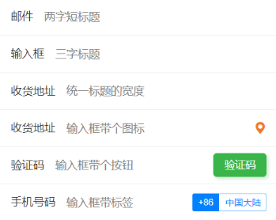

```html
<view class="cu-form-group margin-top">
  <view class="title">邮件</view>
  <input placeholder="两字短标题" name="input"></input>
</view>
<view class="cu-form-group">
	<view class="title">输入框</view>
	<input placeholder="三字标题" name="input"></input>
</view>
<view class="cu-form-group">
	<view class="title">收货地址</view>
	<input placeholder="统一标题的宽度" name="input"></input>
</view>
<view class="cu-form-group">
	<view class="title">收货地址</view>
	<input placeholder="输入框带个图标" name="input"></input>
	<text class='cuIcon-locationfill text-orange'></text>
</view>
<view class="cu-form-group">
	<view class="title">验证码</view>
	<input placeholder="输入框带个按钮" name="input"></input>
	<button class='cu-btn bg-green shadow'>验证码</button>
</view>
<view class="cu-form-group">
	<view class="title">手机号码</view>
	<input placeholder="输入框带标签" name="input"></input>
	<view class="cu-capsule radius">
		<view class='cu-tag bg-blue '>
			+86
		</view>
		<view class="cu-tag line-blue">
			中国大陆
		</view>
	</view>
</view>
```